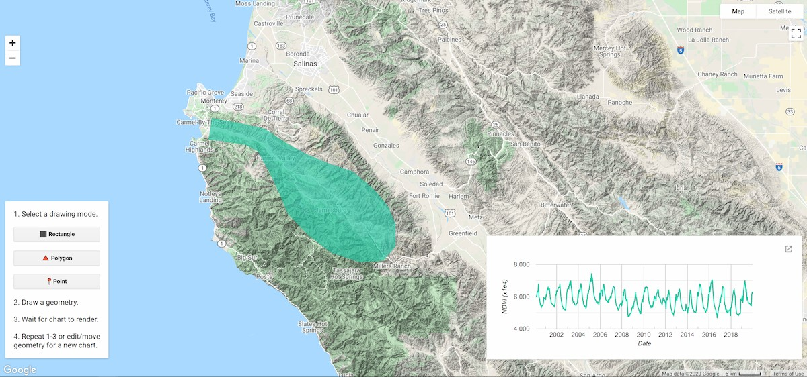
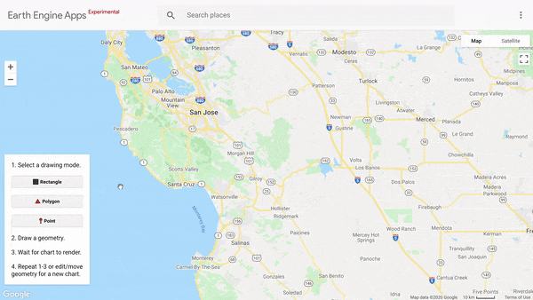

<!--
Copyright 2020 The Google Earth Engine Community Authors

Licensed under the Apache License, Version 2.0 (the "License");
you may not use this file except in compliance with the License.
You may obtain a copy of the License at

    https://www.apache.org/licenses/LICENSE-2.0

Unless required by applicable law or agreed to in writing, software
distributed under the License is distributed on an "AS IS" BASIS,
WITHOUT WARRANTIES OR CONDITIONS OF ANY KIND, either express or implied.
See the License for the specific language governing permissions and
limitations under the License.
-->

This tutorial demonstrates how to use the [drawing tools
API](https://developers.google.com/earth-engine/ui_widgets#ui.map.drawingtools)
with a custom interface to make a simple [Earth Engine
App](https://developers.google.com/earth-engine/apps) that charts an NDVI
time series for a user-drawn geometry. The app provides options for drawing a
rectangle, polygon, or point. It listens for when a user draws a geometry and
displays a chart of mean NDVI for pixels intersecting the drawn geometry.

<br>
_The Earth Engine App resulting from this
tutorial. Shown is an NDVI time series chart for the drawn polygon around
Carmel Valley, California._

## Setup the user interface

This section defines control and chart panels to add to the Map. The control
panel will contain instructions and drawing tool buttons, and the chart panel
will contain the NDVI time series chart.

1\. Define a dictionary of symbols to augment the text label for each of the
geometry buttons defined in the following step. The symbols are kept separate
from the text to avoid unexpected cursor behavior when mixing symbols and
text. The symbols will be concatenated with text in the following step.

```js
var symbol = {
  rectangle: '⬛',
  polygon: '🔺',
  point: '📍',
};
```

2\. Define a `ui.Panel` to hold app instructions and the geometry drawing
buttons. Use a `ui.Label` for each instruction line and a `ui.Button` for
each of the three geometry drawing options. Button labels are the
concatenation of a symbol (defined in the previous step) and text. Note that
button elements have an `onClick` parameter that accepts a function that
fires when the button is clicked; the provided named functions are defined in
a following step.

```js
var controlPanel = ui.Panel({
  widgets: [
    ui.Label('1. Select a drawing mode.'),
    ui.Button({
      label: symbol.rectangle + ' Rectangle',
      onClick: drawRectangle,
      style: {stretch: 'horizontal'}}),
    ui.Button({
      label: symbol.polygon + ' Polygon',
      onClick: drawPolygon,
      style: {stretch: 'horizontal'}}),
    ui.Button({
      label: symbol.point + ' Point',
      onClick: drawPoint,
      style: {stretch: 'horizontal'}}),
    ui.Label('2. Draw a geometry.'),
    ui.Label('3. Wait for chart to render.'),
    ui.Label('4. Repeat 1-3 or edit/move\ngeometry for a new chart.',
      {whiteSpace: 'pre'})
  ],
  style: {position: 'bottom-left'},
  layout: null,
});
```

3\. Define a panel to hold the NDVI time series chart. Set the `shown` style
parameter to `false` to initially hide the panel until the first NDVI time
series chart is rendered (handled in the
[Regional NDVI time series chart](#regional-ndvi-time-series-chart) section).

```js
var chartPanel = ui.Panel({
  style: {
    height: '235px',
    width: '600px',
    position: 'bottom-right',
    shown: false
  }
});
```

4\. Add the panels to the `Map`.

```js
Map.add(controlPanel);
Map.add(chartPanel);
```

### Dealing with geometries

1\.  Get the drawing tools widget object. It will be accessed repeatedly,
define it as a variable for convenience in recalling later.

```js
var drawingTools = Map.drawingTools();
```


2\. Hide the default drawing tools so you can add your own. You can use the
default drawing tools, but they provide more functionality than is needed in
this example and simplicity is the goal.

```js
drawingTools.setShown(false);
```

3\. Set up a while loop to clear all existing geometries that have been added
as imports from drawing tools (from previously running the script). The
design of the app is to handle charting a time series for a single geometry,
so remove any that exist.

```js
var nLayers = drawingTools.layers().length();
while (nLayers > 0) {
  var layer = drawingTools.layers().get(0);
  drawingTools.layers().remove(layer);
  nLayers = drawingTools.layers().length();
} 
```

4\. Initialize a dummy `GeometryLayer` with `null` geometry to act as a
placeholder for drawn geometries.

```js
var dummyGeometry = ui.Map.GeometryLayer({
  geometries: null, name: 'geometry', color: '23cba7'});

drawingTools.layers().add(dummyGeometry);
```

5\. Define a series of functions that fire when each of the geometry buttons
is clicked: one for clearing the previous geometry from the `GeometryLayer`
and one for each drawing mode: rectangle, polygon, and point.

The `clearGeometry` function is necessary because if the previous geometry is
not cleared, the `GeometryLayer` becomes a multipolygon as each new drawing
is added to the list of geometries - the region reduction of NDVI is no
longer based on a single region. In some applications this may be desirable,
but not in this simple example. Another reason is that the rectangle drawing
event does not integrate well with the other drawing modes because it is
non-geodesic, so additional `GeometryLayer`s are added as imports to handle
the change, further complicating the reduction of NDVI.

```js
function clearGeometry(){
  var layers = drawingTools.layers();
  layers.get(0).geometries().remove(layers.get(0).geometries().get(0));
}
```

Define a function for each drawing mode that will fire `onClick` for each of
the drawing mode buttons defined above. Each function will clear previous
drawings using the `clearGeometry` function and then initialize drawing for
the particular mode.

```js
function drawRectangle(){
  clearGeometry();
  drawingTools.setShape('rectangle');
  drawingTools.draw();
}

function drawPolygon(){
  clearGeometry();
  drawingTools.setShape('polygon');
  drawingTools.draw();
}

function drawPoint(){
  clearGeometry();
  drawingTools.setShape('point');
  drawingTools.draw();
}
```

5\. Set the drawing tools widget to listen for geometry drawing and editing
events and respond with a function to chart the NDVI time series for the
newly drawn or edited region. The NDVI time series charting function has not
be defined yet, but its name can be provided as `chartNdviTimeSeries`.

Note that `ui.util.debounce` wraps the `chartNdviTimeSeries` function to
reduce the frequency of it being invoked while drawing and editing a
geometry. For instance, while dragging a vertex to edit a geometry, the
callback function would fire continually, if debounce was not set, which can
be a burden on compute resources for an expensive function. Here, the delay
is set to 500 milliseconds or 0.5 seconds.

```js
drawingTools.onDraw(ui.util.debounce(chartNdviTimeSeries, 500));
drawingTools.onEdit(ui.util.debounce(chartNdviTimeSeries, 500));
```

### Regional NDVI time series chart

1\. Import the MODIS 16-day 1km global vegetation index dataset.

```js
var modisVeg = ee.ImageCollection("MODIS/006/MOD13A2");
```

2\. Define a function that gets called on geometry drawing and editing events
to generate the NDVI time series chart. See the in-code comments for an brief
explanation of each step. In short, the function initializes the chart panel
on the first drawing, clears previously rendered charts if ......

```js
function chartNdviTimeSeries() {
  // Make the chart panel visible the first time.
  if(!chartPanel.style().get('shown')){
    chartPanel.style().set('shown', true);
  } else { // Clear the chart panel.
    chartPanel.clear();
  }

  // Get the geometry
  var aoi = drawingTools.layers().get(0).getEeObject();

  // Set drawing mode back to null.
  drawingTools.setShape(null);

  // Adjust scale depending on map scale to avoid memory limitations/timeouts.
  var mapScale = Map.getScale();
  var scale = mapScale > 5000 ? mapScale * 2 : 5000;

  // Chart NDVI time series for the selected area of interest.
  var chart = ui.Chart.image.seriesByRegion({
    imageCollection: modisVeg,
    regions: aoi,
    reducer: ee.Reducer.mean(),
    band: 'NDVI',
    scale: scale,
    xProperty: 'system:time_start'
  })
  .setOptions({
    titlePostion: 'none',
    legend: {position: 'none'},
    hAxis: {title: 'Date'},
    vAxis: {title: 'NDVI (x1e4)'},
  });
  chartPanel.widgets().reset([chart]);
}
```

The following animation is the result of putting the entire script together and
publishing it as an Earth Engine App. The simplicity of the custom drawing
tool interface and automatic clearing of the previous drawing and
plot will allow you and your app users to focus on exploring data instead of
geometry management.



Learn more about the drawing tools API from this
[tutorial](https://developers.google.com/earth-engine/tutorials/community/drawing-tools)
and [guide](https://developers.google.com/earth-engine/ui_widgets#ui.map.drawingtools).
